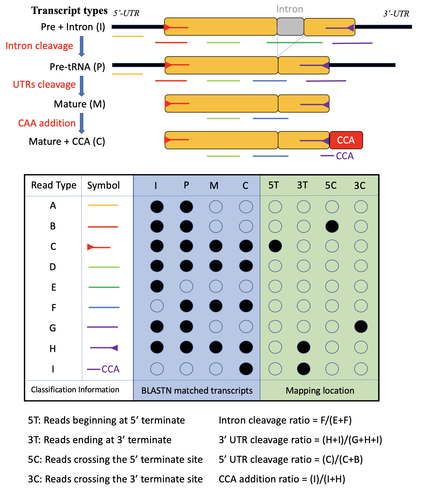
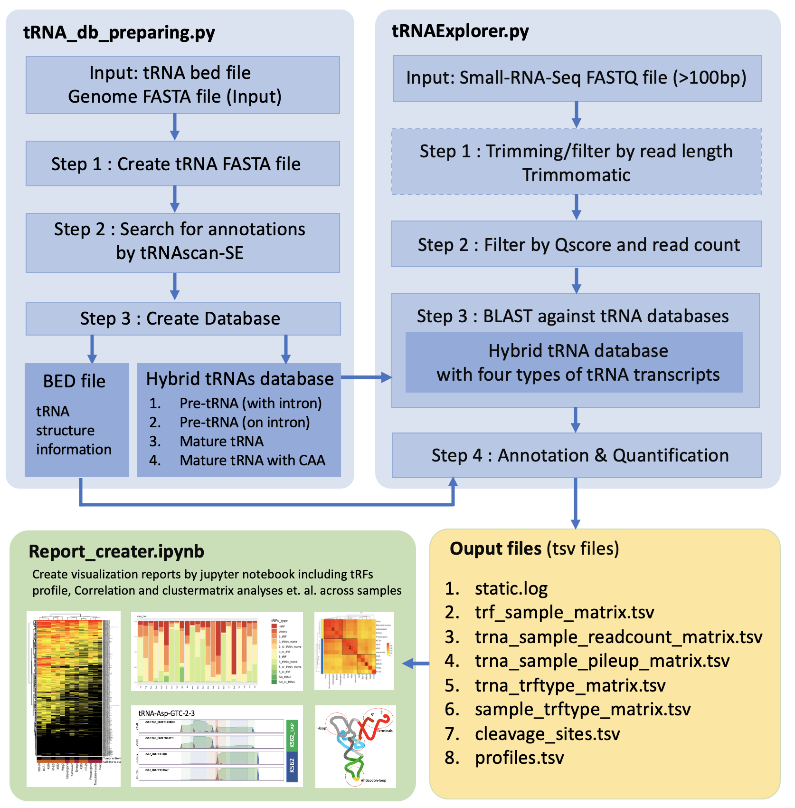
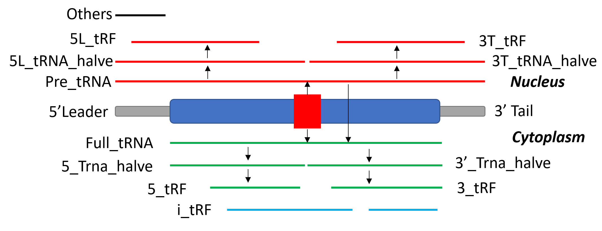

# tRNAExplorer (v1.0)
## 1. Introduction
tRNAExplorer is a Python pipeline optimized for analyzing tRF (tRNA-derived fragments) profiles of multiple samples using small-RNA-seq data.
* Major functions:
    * Categorize and quantify tRNA/tRFs.
    * Discover novel tRNA cleavage sites.
    * Discover new base additions on tRFs 
    * Comparison and visualization of tRF profile across multiple samples
* References:
    * Sun, Z., Tan, J., Zhao, M. et al. Integrated genomic analysis reveals regulatory pathways and dynamic landscapes of the tRNA transcriptome. Sci Rep 11, 5226 (2021). https://doi.org/10.1038/s41598-021-83469-6

## 2. Requirements
Docker or Followings
1. Trimmomatics 0.39  http://www.usadellab.org/cms/uploads/supplementary/Trimmomatic/Trimmomatic-0.39.zip
2. BLASTN (ncbi-blast-2.10.0+) https://ftp.ncbi.nlm.nih.gov/blast/executables/blast+/LATEST/
3. tRNAScan-SE  http://lowelab.ucsc.edu/tRNAscan-SE/
4. Python (version 3.x) and packages.
   * jupyter>=1.0.0
   * scipy==1.1.0
   * numpy>=1.16.1
   * pandas==0.23.0
   * matplotlib==2.2.5
   * seaborn>=0.11.0
   * pysam >= 0.8
   * HTSeq>=0.11.0
   * pathlib
   * plotly
   
    User can install these python libraries using requirement files ([Python3](./lib_code/requirements_3.txt)) 
    
    Using : `pip3 install -r requirements_3.txt` or `pip install -r requirements.txt`
## 3. Installation
1. Docker (Recommended)
    * Method 1: Using the [Dockerfile](./docker/Dockerfile) to generate image  
        Run `docker build -t <trna>` in the folder contaning the Dockerfile
    * Method 2: Download docker image from [dockerhub](https://hub.docker.com/repository/docker/hqyone/trna_explorer)
        Run `docker push hqyone/trna_explorer:v1_0` to get the image
    * Details about launch tRNAExplorer using the image can be found in the [Dockerfile](./docker/Dockerfile)
2. Regular installation
    * Step 1: Download and unzip the pipeline  https://github.com/hqyone/tRNAExplorer/archive/master.zip
    * Step 2: Install software in requirements ... 
    * Step 3: Initialization settings:
        * Find and modify the file named [init](init) at the root directory of tRNAExplorer (Important !!!)
        * Change the absolute path for Trimmomatics, BLASTN and makeblastdb in the file.

## 4. Running
* Run testing data by      `python tRNAExploer.py`
* Get help information  `python tRNAExploer.py -h`
* Create a sample tsv file with three columns (The title line should be keeped) ([example](./test/samples))

    | Column  | Description  |
    | :------------ |:--------------------------------| 
    | ID    | ID of sample, match the name of FASTQ file in fastq_dir. For example: `<ID>.fastq` or `<ID>.fq` | 
    | Description     | Short string describe the sample |
    | Adapters     | Adapter sequences seperated by "," 5'-adapter, 3'-adapter. For example: "NNNNCG,AAAAAAAAA" OR ",AAAAAAAA" no cutting need be done in 5'-terminal |   

* Run with customized data: `python tRNAExploer.py -n <proj_name> -f <trna_fa> -a <trna_anno_file> -s <sample tsv> -i <fastq_dir> -o <out_dir>`
    * -n <proj_name>: optional, a string, the name of project, default is 'test'
    * -f <trna_fa>: the path of a tRNA FASTA file which is generated by tRNA_db_maker.py default database can be found at <root>/test/trna_db/hg38_tRNA_60.fa for 'hg38' genome
    * -a <trna_anno_file>: the path of a tRNA bed file which is generated by tRNA_db_maker.py default database can be found at <root>/test/trna_db/hg38_tRNA_60.bed for 'hg38' genome
    * -s <sample tsv>: the path of sample tsv file made by the previous step (default: <root>/test/samples)
    * -i <fastq_dir>: the path of directory containing FASTQ files (default: <root>/test/fastq)
    * -o <out_dir>: the path of directory to store output files (default: <root>/test/output)
* Run with advanced settings using config file: 
    *   Modify config.txt  (taken [config.txt](config.txt) in root directory as template)
    *   Run `python tRNAExplorer.py -c config.txt`
    *   Details about tRNAExplorer.py can be found [here](./help/tRNAExplorer_manual.md)
* Make Customized tRNA Databases
    *   Run `python tRNA_db_maker.py -n <name> -b <bed> -r <ref> -s <tRNAScanSE> -o <offset> --no_mit <1/else> --no_pseu <1/else> --minq <number>`
    *   Details about tRNA_db_maker.py can be found [here](./help/tRNA_db_maker_manual.md)

## 5. Mapping Strategy
In tRNAExplorer, any tRNA fragments derived from tRNA genes are considered as tRFs including mature tRNAs and their precursors. 

As the tRFs usually are subjects of chemical modifications and editing, the global and exactly match strategy is not good enough to identify tRFs from small-RNA-Seq data. Therefore, tRNAExplorer takes BLASTN as the engine to map small-RNA-Seq reads to tRNA related transcript database.
The database contains four major style of tRNA gene transcripts:

* tRNA precursor with intron(s) (I)
* tRNA precursor without intron(s) (P)
* Mature tRNA (M)
* Mature tRNA with CCA (C)

For each read/tRF, only the best alignments will be kept for further analysis. For example, the type D reads in figure S1 can be mapped to all four types of transcripts from a tRNA gene. Based on the mapped transcript types and mapping locations, the reads can be categorized into one of 9 types (A-I). 

For a tRNA gene, based on the composition of reads mapping to it, we can elucidate the relative abundance of four transcripts of a tRNA gene. For example, tRFs of type E and F should derived from tRNA transcripts before and after intron splicing. Using read count will can elucidate the relative abundant of transcript I.
Additionally, a tRF can be map to multiple tRNAs with the best/equal fidelity. Its related reads will be split into and assigned to them equally. Although, the assignment is ambiguous, the method makes it easy to estimate transcription level of tRFs/tRNAs in multiple level (gene, families, isodecoder and isoacceptor sets) by summing them up.

 

Figure 1: The definitions of four tRNA transcript types and nine read types. 

## 6. Architecture
The tRNAExplorer contains three modules:
*   tRNAExplorer.py : main program to mapping and quantify tRNA/tRF
*   tRNA_db_maker.py : program to format the tRNA database which will be used by tRNAExplorer.py
*   Report_creater.ipynb : program to analysis data and draw chart to visualization data.

Processing steps are summarized in Figure 2 

Figure 2. The architecture of tRNAExplorer. 

## 7. tRF types
Actually, tRFs are any RNA fragments or transcripts that divided from tRNA genes.
tRNAExplorer defines 12 types of tRFs based on their mapping place on tRNA genes.

Figure 3. tRF types in tRNAExplorer 

## 8. Visualization
A jupyter notebook [Report_creator.ipynb](./visualization/Report_creater.ipynb) was designed to analysis and visualization data (tsv files) generated by tRNAExplorer.py.
This notebook is self-explained. User can launch the notebook using following commands
 *  ` cd <root>/visualization`
 *  ` jupyter notebook`

The user can also do their own analysis based on these tsv files.

## 9. Testing Data
* Trimming FASTQ files can be found ` <root>/test/fastq` 
* The testing data (SRA_ID: SRP055858, SRA files) was downloaded from https://www.ebi.ac.uk/ena/data/view/PRJNA277309
* For reducing testing time, only 50000 spots from each sample are extracted using the command :
`fastq-dump -X 50000 -Z sra > fastq`
* References
    1. Zheng G, Qin Y, Clark WC, et al. Efficient and quantitative high-throughput tRNA sequencing. Nature Methods. 2015 Sep;12(9):835-837. DOI: 10.1038/nmeth.3478.
    2. Clark WC, Evans ME, Dominissini D, Zheng G, Pan T. tRNA base methylation identification and quantification via high-throughput sequencing. RNA (New York, N.Y.). 2016 Nov;22(11):1771-1784. DOI: 10.1261/rna.056531.116.

## 10. License
Copyright (c) 2020 Quanyuan He Ph.D.

Contact: [hqyone@hotmail.com](mailto:hqyone@hotmail.com)

Released under GPLv3. See
[license](LICENSE.txt) for details.

## 11. Disclaimer
This software is supplied 'as is' without any warranty or guarantee of support. The developers are not responsible for its use, misuse, or functionality. In no event shall the authors or copyright holders be liable for any claim, damages, or other liability arising from, out of, or in connection with this software.