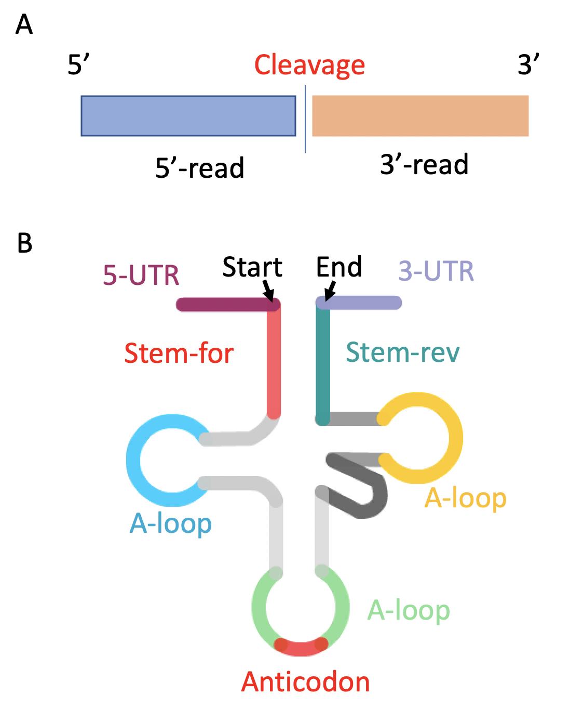

# Manual for tRNAExplorer.py (2020/7/11)
## 1. Usage
* Run test data by      `python <root path>/tRNAExploer.py`
* Get help information  `python <root path>/tRNAExploer.py -h`
* Run with customized data: `python <root path>/tRNAExploer.py -n <proj_name> -f <trna_fa> -a <trna_anno_file> -s <sample tsv> -i <fastq_dir> -o <out_dir>`
* Run with advanced settings using config file: 
    *   Modify config.txt  (taken [config.txt](config.txt) in root directory as template)
    *   Run `python <root path>/tRNAExplorer.py -c config.txt`
    *   Details about tRNAExplorer.py can be found following ...
## 2. Settings
* There are two ways to config the pipeline: using command options or a config file.
* When you use both way together, the options in config files will overwrite command options
### 2.1 Command options
* User can use command options to launch pipeline

| Option  | Description  |
| :------------ |:--------------------------------| 
| -c     | The absolute path of config file | 
| -n     | The name of project  |  
| -f     | Absolute path of FASTA file for tRNAs which was created by [tRNA_db_maker.py](./tRNA_db_maker_manual.md) |  
| -a     | Absolute path of bed file for tRNA annotations which was created by  [tRNA_db_maker.py](./tRNA_db_maker_manual.md)  |  
| -s     | Absolute path of sample information  |  
| -i     | The directory storing FASTQ files (Input Directory)  |  
| -h     | Show the help information  |  
| -o     | The directory of output files (Out Directory)| 

### 2.2 Configure file [(see a sample)](config.txt)
* Configure file is a place to set all options available for the pipeline. 
* User can use [config.txt](config.txt) as a template to customize it.
* Removing/Adding the "#" at the start of line will enable/disable following option
* Notice: The option in configure file will overwrite the settings in command line

| Name  | Section  | Default  |Description
| :---------|:---------|:-------------|:--------------------------------| 
| proj_name  | General  | NA | Project name | 
| trna_fa    | General  | NA | Absolute path of fasta file for tRNAs which was created by tRNA_db_maker |   
| trna_anno_file    | General | NA  | Absolute path of bed file for tRNA annotations which was created by tRNA_db_maker |
| sample_tsv  | General | NA  | Absolute path of sample information | 
| fastq_dir    | General | NA | The directory storing FASTQ files (Input Directory) |   
| out_dir    | General | NA | The directory of output files (Out Directory) |
| url_len    | General | 60 | The length of UTRs, default = 60', it should match utr length in trna_anno bed |
| t_do  | Trimmomatic  | 1 | Whether trimming sequences 0 means "no" others means "yes"| 
| t_adapter    | Trimmomatic | Space | Absolute path for adapter FASTA file, When the file is not available using <trimmomatic_dir>+"/adapters/TruSeq3-SE.fa |   
| t_phred    | Trimmomatic  | 33 | phred cutoff to trim sequence |
| t_leading  | Trimmomatic  | 3 | Cut bases off the start of a read, if below a threshold quality | 
| t_tailing    | Trimmomatic  | 3 | Cut bases off the end of a read, if below a threshold quality |   
| t_slidingwindow   | Trimmomatic |"4:15" | Perform a sliding window trimming, cutting once the average quality within the window falls below a threshold |
| t_minlen    | Trimmomatic  | 18 | Drop the read if it is below a specified length |
| t_threads   | Trimmomatic  | 2 | The number of thread to run trimmomatic |
| min_read_qscore  | Filtering  | 20 | Remove reads, if it contains any base below a threshold quality| 
| min_reads_count    | Filtering | 50 | Remove reads, if the read appears less than certain times in the FASTQ file |   
| blastn_e_cutoff    | BLASTN  | 0.001 | The evalue cutoff to report the match|
| blastn_max_hit_num  | BLASTN  | 40 | The maximum number of matched hits | 
| blastn_max_mismatch | BLASTN | 2 |The max allow mismatch number |
| blastn_pident | BLASTN | 98 |The minimum percentage of identify (0-100) |
| min_trf_len    | TRF  | 18 | The minimum of tRF length |   
| blastn_max_mismatch   | TRF | 2 | The max mismatch allow for valid matches |

Notice: All filtering criteria should be meet in the same time. 

## 3. Output
### 3.1 static.log
* The file includes reads numbers, processing time for each sample.
* See a [sample](../test/output/static.log)

| Column  | Description  |
| :------------ |:--------------------------------| 
| #SampleID      | sample ID | 
| Description     | Description of sample  |  
| total_num     | Total number of reads in input FASTQ file  |  
| removed_num     | Total number of reads removed by trimming and filtering |  
| survived_num     | Total number of reads in the trimmed and filtered FASTQ file  |  
| non_redundant_num     | The number of non redundant reads in FASTA file  |  
| start_time     |  Time stamp to starting processing  |  
| end_time     | Time stamp to ending processing  |  
| processing_time     | Total time used for processing the sample  |  
| trim_time     | Time used by trimming (seconds)  |  
| filter_time     | Time used by filtering and removing redundant reads (seconds)  |  
| blastn_time     | Time used by mapping using BLASTN (seconds)  |  
| A ... I    | The numbers of nine types of reads  |
| total     | Total number of tRNA mapped reads  |    
| intro_cl_ratio     | Intron cleavage ratio = F/(E+F)  |  
| u5_cl_ratio     | 5’ UTR cleavage ratio = (C)/(C+B)  | 
| u3_cl_ratio     | 3’ UTR cleavage ratio = (H+I)/(G+H+I)  | 
| cca_add_ratio     | CCA addition ratio = (I)/(I+H)| 

### 3.2 trf_sample_matrix.tsv 
* Read number matrix of tRFs across tRFs and samples
* See a [sample](../test/output/trf_sample_matrix.tsv)

| Column  | Description  |
| :------------ |:--------------------------------| 
| tRF_ID      | Sequence based ID of tRF | 
| tRNA_Families     | tRNA Family  |  
| tRNA_IDs     | The list of tRNA hit information including tRF type and matching location. The pattern is: [ tRNA_ID, tRF_type, Read_type, start_index (0 based), end_index (0 based), read_num, read_seq, match_seq]|  
| seq     | Sequence of tRF  |  
| sample IDs ....     | List of sample IDs  |  

### 3.3 trna_sample_readcount_matrix.tsv 
* Read number matrix across tRNAs and samples
* See a [sample](../test/output/trna_sample_readcount_matrix.tsv)

| Column  | Description  |
| :------------ |:--------------------------------| 
| #RNA_family      | tRNA Family ID | 
| tRNA_ID     | ID of tRNA  |  
| sample IDs ....     | List of sample IDs  |    

### 3.4 trna_sample_pileup_matrix.tsv
* Pileup depth matrix across tRNAs and samples 
* See a [sample](../test/output/trna_sample_pileup_matrix.tsv)

| Column  | Description  |
| :------------ |:--------------------------------| 
| #RNA_family      | tRNA Family ID | 
| tRNA_ID     | ID of tRNA  |  
| sample IDs ....     | List of sample IDs  | 
  
### 3.5 trna_trftype_matrix.tsv
* The read number matrix across samples/tRNAs and tRF types
* See a [sample](../test/output/trna_trftype_matrix.tsv)

| Column  | Description  |
| :------------ |:--------------------------------| 
| #SampleID      | Sample ID | 
| tRNA_ID     | ID of tRNA  |  
| Sample IDs ....     | List of sample IDs  | 

### 3.6 sample_trftype_matrix.tsv
* The read number matrix across samples and tRF types
* See a [sample](../test/output/sample_trftype_matrix.tsv)

| Column  | Description  |
| :------------ |:--------------------------------| 
| #SampleID      | Sample ID | 
| tRF type ...     | The type of tRFs includes full_tRNA,   |  
| Sample IDs ....     | List of sample IDs  | 

### 3.7 cleavage_sites.tsv
* Cleavage sites information for tRNAs in different samples
* Theoretically，a cleavage of RNA will create two reads (5' and 3' reads) (A)
* tRNAExplorer defined eleven types of cleavage sites (B)

* See a [sample](../test/output/cleavage_sites.tsv)

| Column  | Description  |
| :------------ |:--------------------------------| 
| #SampleID      | Sample ID | 
| tRNA_family     | The ID of tRNA family   |  
| tRNA_ID     | The ID of tRNA  | 
| ID     | The ID of cleavage sites P+location in tRNA precursor   |  
| Position     | The location of cleavage site (the index of last base of 5' reads, the index of the first base of mature tRNA is 0 )  | 
| PType     | 11 types of cleavage site including 5-UTR, Start, 3-UTR, End, Anticodon, D-loop, A-loop, T-loop, stem_for, stem_rev, Other.|  
| Intensity | The number of observed reads (5' reads + 3' reads) supporting the cleavage site | 
| Intensity_5     | The number of 5' reads | 
| Intensity_3     | The number of 3' reads |  
| SNRatio     | Signal/Noise ratio of the cleavage site  | 
| Seq_5     | The 5' clipped sequences  |  
| Seq_3 | The 3' clipped sequences  | 
| full_Seq | Seq5 + Seq3   | 

### 3.8 profiles.tsv
* Pileup information for tRNAs in different samples
* See a [sample](../test/output/profiles.tsv)

| Column  | Description  |
| :------------ |:--------------------------------| 
| #SampleID      | Sample ID | 
| tRNA_family     | The ID of tRNA family   |  
| tRNA_ID     | The ID of tRNA  | 
| type     | Three types of profile including "start_pos","end_pos","total","isequence","mutation_dic_str" | 
| Profile     | Pileup intensity in base solution across tRNA precursors without intron | 

Notice: 
* "isequence" is the sequences of precursor+intron 
* "mutation_dic_str" contains mutation information such as type and position(1 based).
    *  For example for `M:A>T:117=55.0` means a replacement of A to T at 117 th base (1 based ) with 55 reads to support. 

### 3.9 variants.tsv
* Variant sites observed for tRNAs in different samples

| Column  | Description  |
| :------------ |:--------------------------------| 
| #SampleID      | Sample ID | 
| family    | The family of tRNA,   |  
| tRNA_ID     | The ID of tRNA  | 
| type     | Mutation type I(insert), M(mutation), D(Deletion)  |
| loc     | location in mature tRNA  |
| ref     | The base of ref  |
| mut     | The base of mutation  |
| mut_read     | The number of mutated reads covered the site  |
| total_reads     | The total number of reads covered the site |
| ratio     | The ratio of mutation  |

### 3.10 <SAMPLE_ID>_<project_name>_hit.tab
* Details about read mapping to mRNA for each sample
* The meaning of tRNA transcription type can be found in figure 1 of [README.md](../README.md)
* See a [sample](../test/output/profiles.tsv)

| Column  | Description  |
| :------------ |:--------------------------------| 
| #tRNA_family      | Sample ID | 
| tRNA_id     | The ID of tRNA |  
| read_id     | ID of read in FASTQ  |
| direction     | The direction of read to map to sequences  |
| I     | A marker indicates whether the read map to I type transcript (0 means not mapping)   |
| I_read_start   | The start position in read (-1 means not mapping) |
| I_read_end     | The end position in read  (-1 means not mapping)|
| I_trna_start   | The start position in tRNA  (-1 means not mapping)|
| I_trna_end | The end position in tRNA  (-1 means not mapping)|
| P     | A marker indicates whether the read map to P type transcript (0 means not mapping)   |
| P_read_start   | The start position in read (-1 means not mapping) |
| P_read_end     | The end position in read  (-1 means not mapping)|
| P_trna_start   | The start position in tRNA  (-1 means not mapping)|
| P_trna_end | The end position in tRNA  (-1 means not mapping)|
| M     | A marker indicates whether the read map to M type transcript (0 means not mapping)   |
| M_read_start   | The start position in read (-1 means not mapping) |
| M_read_end     | The end position in read  (-1 means not mapping)|
| M_trna_start   | The start position in tRNA  (-1 means not mapping)|
| M_trna_end | The end position in tRNA  (-1 means not mapping)|
| C     | A marker indicates whether the read map to C type transcript (0 means not mapping)   |
| C_read_start   | The start position in read (-1 means not mapping) |
| C_read_end     | The end position in read  (-1 means not mapping)|
| C_trna_start   | The start position in tRNA  (-1 means not mapping)|
| C_trna_end | The end position in tRNA  (-1 means not mapping)|
| 5T     | A marker indicates whether the read begin at 5'-term of tRNA (0 means no, 1 means yes)  |
| 3T     | A marker indicates whether the read end at 3'-term of tRNA (0 means no, 1 means yes)  |
| 5C     | A marker indicates whether the read begin at 5'-term of tRNA (0 means no, 1 means yes)  |
| 3C     | A marker indicates whether the read begin at 5'-term of tRNA (0 means no, 1 means yes)  |
| mean_number  | The number of reads mapping to tRNA|
| hit_tRNAs_num | The number of tRNA that the read map to|
| TRF_type | The type of TRF |
| brief_mapping_infor | A string presents the mapping detailed information. The pattern are as following: <Read Type>,<map_start>,<map_end>,<read_number>,<read_map_seq>,<tRNA_map_seq>. The start and end position here is 1 based|
| Read_type| The type of read (A-I), please see figure 1 of [README.md](../README.md)|
| mapping_ratio| The ratio of the length of mapping region  to the length of read|
| mapping_ratio| The ratio of the length of mapping region  to the length of read|
| read_5_fragment | The 5' part of read which dose not mapping to tRNA sequences |
| read_fragment | The part of read which mapping to tRNA sequences |
| read_3_fragment | The 3' part of read which dose not mapping to tRNA sequences |

### 3.11 visual_config.tsv
* A tsv file including paths of files required for the visualization module.
* See a [sample](../test/output/visual_config.tsv)

| Row  | Description  |
| :------------ |:--------------------------------| 
| out_dir    | Directory of output | 
| sample_tsv     | The tsv of sample sheet |  
| trna_anno_bed     | The BED file with tRNA sequence and annotations  |